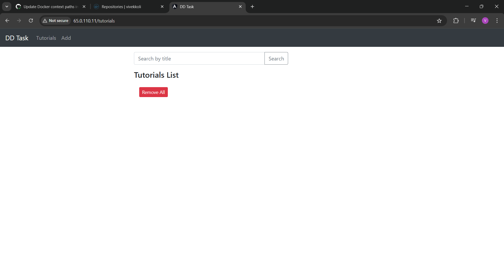
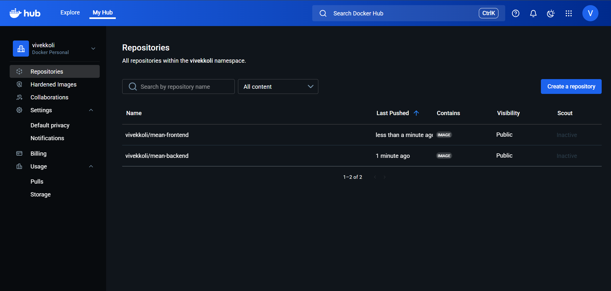
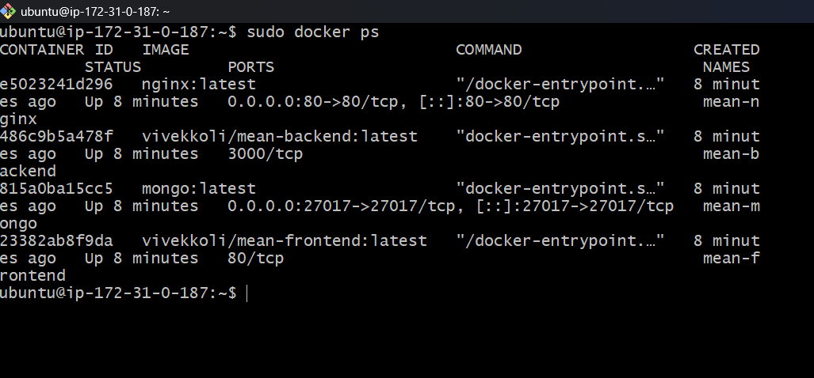

# MEAN Stack Application with DevOps Automation

This repository contains a Full Stack MEAN (MongoDB, Express, Angular, Node.js) application containerized with Docker and deployed to AWS EC2 using a CI/CD pipeline via GitHub Actions.

## 🚀 Project Overview
- **Frontend:** Angular
- **Backend:** Node.js & Express
- **Database:** MongoDB
- **Proxy:** Nginx (Reverse Proxy)
- **Containerization:** Docker & Docker Compose
- **CI/CD:** GitHub Actions
- **Deployment:** AWS EC2 (Ubuntu)

## 🛠️ Architecture
1. **Docker:** Both Frontend and Backend are containerized using Multi-stage builds.
2. **Nginx:** Configured as a reverse proxy to route traffic to Frontend (Port 80) and Backend API (Port 3000).
3. **CI/CD Pipeline:**
   - **Build:** Automatically builds Docker images on `git push`.
   - **Push:** Pushes images to Docker Hub.
   - **Deploy:** Connects to AWS EC2 via SSH, pulls the latest images, and updates the running containers using Docker Compose.

## ⚙️ Setup & Deployment Steps

### Prerequisites
- Docker & Docker Compose installed on the server.
- AWS EC2 Instance (Ubuntu) with Ports 80, 3000, and 22 open.

### Local Installation
```bash
# Clone the repository
git clone <https://github.com/vivekkoli22/devops-intern-task.git>

# Navigate to directory
cd crud-dd-task-mean-app

# Run with Docker Compose
docker-compose up -d


## 📸 Project Screenshots

### 1. Application Running on AWS EC2


### 2. GitHub Actions CI/CD Success


### 3. Docker Hub Repository (Images Pushed)


### 4. Terminal Output (Containers Running)
